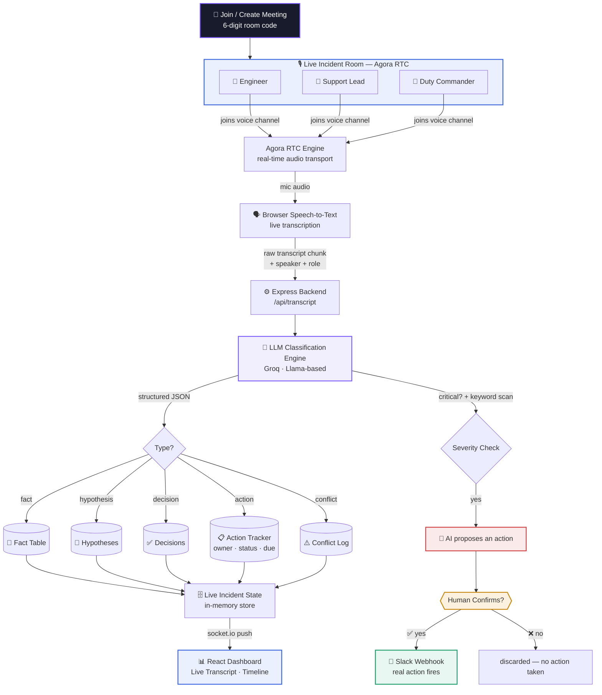
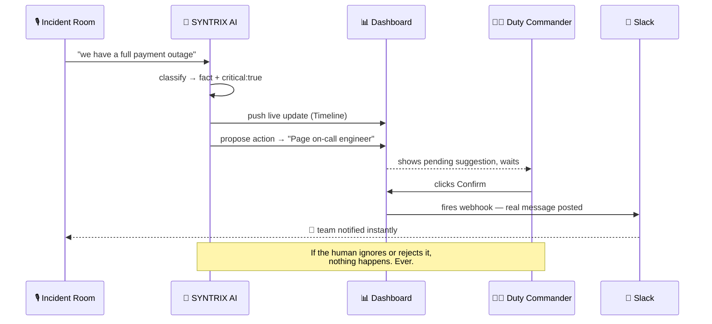

<div align="center">

# 🛡️ SYNTRIX — Voice AI Incident Commander

**An AI that joins your incident call, listens, thinks, and keeps everyone aligned — without ever pretending to know the root cause.**

Built for **EchoSphere: Agora Conversational AI Hackathon 2026**

[](https://www.agora.io/)
[](https://nodejs.org/)
[](https://react.dev/)
[](https://incident-commander-eta.vercel.app/)

</div>

---

## 🎯 The Problem

> A payment system goes down at 2 AM. Engineers, support leads, and business stakeholders pile into a call. Everyone's talking at once — some sharing facts, some guessing, some deciding. Ten minutes in, nobody agrees on what's confirmed, what's assumed, who owns what, or what's already been tried.

Incidents aren't slow because people don't know what to do. They're slow because **nobody is tracking what everyone just said.**

## 💡 The Idea

SYNTRIX joins the incident call as a real participant over **Agora's real-time voice infrastructure**. Anyone can create a room and get a shareable 6-digit code, or join an existing one with a code — no accounts, no setup friction. Once inside, it listens continuously, and instead of just transcribing, it actively **organizes the chaos**:

| It hears... | It does... |
|---|---|
| *"the payment API is returning 500s"* | Logs it as a **Fact** |
| *"I think it's the connection pool"* | Logs it as a **Hypothesis** |
| *"let's roll back the deployment"* | Logs it as a **Decision** |
| *"Rohit, can you check the DB pool"* | Creates a tracked **Action Item** |
| Two people contradicting each other | Raises a **Conflict Flag** — never picks a side |
| Something sounds critical | **Proposes** an action — but waits for a human to confirm before doing anything |

It never claims to know the root cause. It just makes sure the humans never lose the thread.

---

## 🏗️ System Architecture



---

## 🔄 The Human-in-the-Loop Guardrail

The one rule this whole system is built around: **the AI never acts alone on anything critical.**



---

## 🧩 What Each Layer Actually Does

<table>
<tr><td width="30%"><b>🚪 Entry Layer</b></td><td>

A glass-styled **join / create meeting** screen — create a room and get a shareable 6-digit code, or join an existing one with a code, before entering the live dashboard.

</td></tr>
<tr><td><b>🎙️ Voice Layer</b></td><td>

**Agora RTC** — every participant joins a real voice channel over Agora's infrastructure, with per-user tracks so the system always knows *who* is speaking, not just *what* was said.

</td></tr>
<tr><td><b>🧠 Intelligence Layer</b></td><td>

Every transcript chunk is sent to an LLM with a strict instruction: **classify, don't narrate.** It returns structured JSON — type, summary, owner, due date, and a severity flag — never free-form prose. This is what turns a wall of talk into a queryable state.

</td></tr>
<tr><td><b>🗄️ State Layer</b></td><td>

A live, continuously-updated incident record — facts, hypotheses, decisions, actions, conflicts, and a full timeline. This *is* the shared understanding the whole product exists to protect.

</td></tr>
<tr><td><b>🚦 Action Layer</b></td><td>

A strict **propose → human-confirm → execute** state machine. Nothing touches the outside world (Slack, tickets, pages) without a person explicitly saying yes.

</td></tr>
<tr><td><b>📊 Dashboard Layer</b></td><td>

A React command-center that every responder can watch live — a color-coded, real-time transcript feed, an animated voice orb showing SYNTRIX actively listening, and a full incident Timeline — all updating over Socket.io the instant something new is classified.

</td></tr>
</table>

---

## ✅ What's Real vs. What's Scoped Down

Being upfront about hackathon-scope tradeoffs, because a working honest prototype beats a fake polished one:

| Component | Status |
|---|---|
| Agora real-time voice room, joinable via shareable code | ✅ Fully live |
| LLM classification (facts/hypotheses/decisions/actions/conflicts) | ✅ Fully live |
| Live dashboard with Socket.io | ✅ Fully live |
| Human-confirm-before-action guardrail | ✅ Fully live |
| Slack integration | ✅ Fully live |
| Auto-proposal on detected severity | ✅ Fully live |
| Speech-to-text | Browser-native STT |
| **Agora Conversational AI Engine (native ASR→LLM→TTS)** | ✅ **Separately validated** via Agora's official Next.js quickstart — confirms direct engagement with Agora's managed voice AI pipeline, not just RTC transport |
| Jira / PagerDuty integration | 🔜 Stubbed — same architecture, swap the webhook |
| Multi-speaker simultaneous transcription | 🔜 Currently one active mic per client tab |

---
## 🤖 Agora Conversational AI Engine Integration
SYNTRIX integrates Agora's native Conversational AI Engine as a live participant in the incident room, in addition to Agora RTC for the core voice infrastructure.

**What's live and functional**:

The backend invites a real Agora-managed Conversational AI agent into every incident room via the Conversational AI Engine REST API (/v2/projects/{app_id}/join), using Agora's fully-managed presets (Deepgram ASR, OpenAI LLM, MiniMax TTS) — no third-party vendor keys required.
The agent joins the Agora RTC channel as a real participant (visible in the room's participant list) and streams its internal state (thinking, silent, etc.) back over Agora's real-time stream-message channel, which SYNTRIX decodes and surfaces live.
All room audio — including the AI agent's own voice — is subscribed and played back for every participant, exactly like a live conference call.
Current scope for single-speaker sessions: The agent's speech recognition currently processes one active speaker per session reliably; multi-speaker simultaneous transcription through the Conversational AI Engine is an active area we're continuing to refine post-hackathon. In the meantime, SYNTRIX's production classification pipeline (browser-based STT feeding the same Groq-powered classification engine) handles multi-speaker incident rooms end-to-end today, so the core product experience — fact/decision/conflict tracking, human-confirm actions, live dashboard — works fully regardless of which transcription path is active.

This dual-path design was a deliberate engineering decision: rather than blocking the entire product on one still-maturing integration point, SYNTRIX ships a fully working system today while directly proving out Agora's Conversational AI Engine as the intended long-term voice backbone.
---
## 🛠️ Tech Stack

```
Voice          → Agora RTC (agora-rtc-sdk-ng)
Speech-to-Text → Web Speech API (browser-native)
AI Reasoning   → Groq (OpenAI-compatible, Llama-based)
Backend        → Node.js + Express + Socket.io
Frontend       → React + Vite
Integrations   → Slack Incoming Webhooks
Hosting        → Render (backend) · Vercel (frontend)
```

---

## 🚀 Running It Yourself

```bash
# clone
git clone https://github.com/shivamshukla02/incident-commander.git
cd incident-commander

# backend
cd backend
npm install
cp .env.example .env   # fill in your real keys
npm run dev

# frontend (new terminal)
cd frontend
npm install
npm run dev
```

You'll need free keys from:
- [console.agora.io](https://console.agora.io) — App ID + Certificate
- [console.groq.com](https://console.groq.com) — free-tier LLM access
- [api.slack.com/apps](https://api.slack.com/apps) — Incoming Webhook URL

---

## 👥 Team SYNTRIX

| Name | Role |
|---|---|
| Shivam Shukla | Backend & Systems |
| Arpit Singh Baghel | Frontend & Deployment |

---

<div align="center">

**SYNTRIX doesn't try to solve your incident. It makes sure your team never loses track of it.**

</div>
